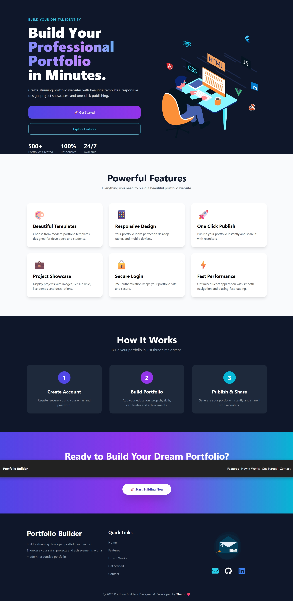
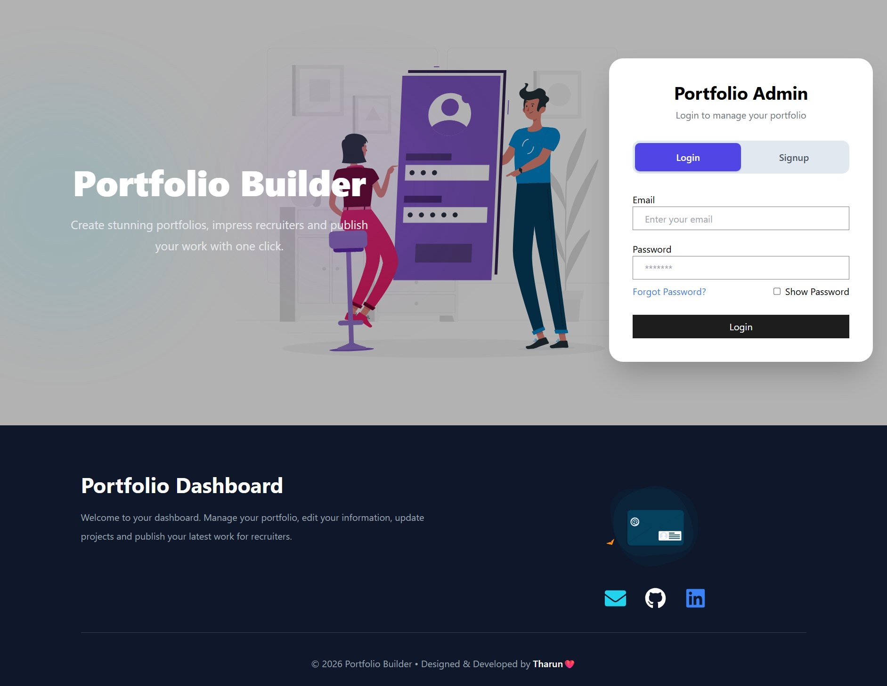
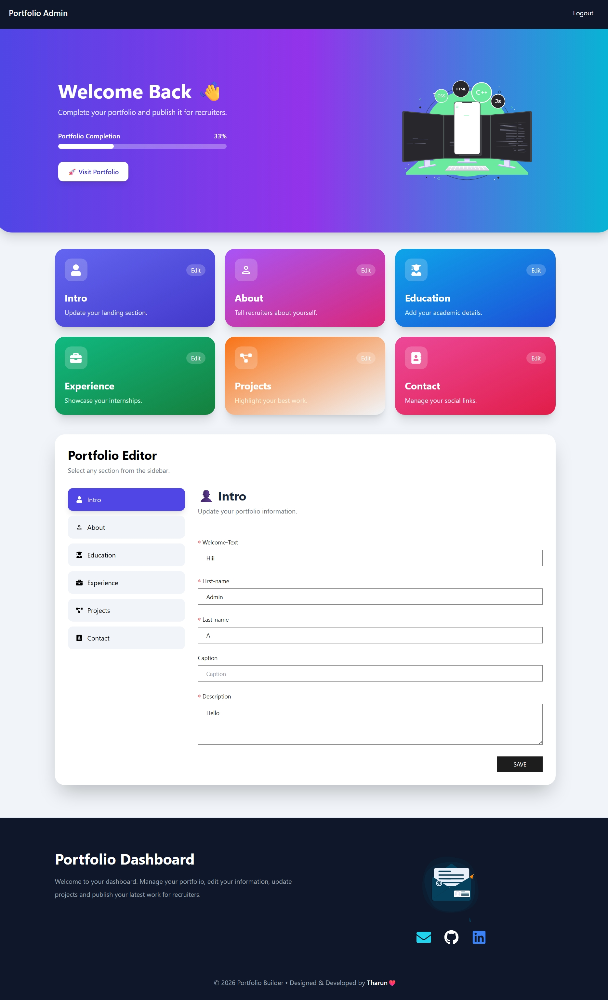

# 🚀 Portfolio Builder

A modern **Full Stack Portfolio Builder** that allows users to create, customize, and publish their own professional developer portfolio without writing any code.

Users can register, log in, manage their profile, projects, education, experience, contact details, upload images, and instantly generate a live portfolio.

---

## ✨ Features

- 🔐 Secure User Authentication (JWT)
- 👤 Personal Portfolio Dashboard
- 📝 Edit Personal Information
- 🎓 Manage Education Details
- 💼 Manage Work Experience
- 🚀 Add Unlimited Projects
- 📞 Contact Information Management
- 🖼️ Image Upload Support
- 🌐 Live Portfolio Generation
- 📱 Fully Responsive Design
- 🎨 Modern UI with Animations
- ⚡ Fast and Smooth User Experience

---

## 🛠️ Tech Stack

### Frontend
- React.js
- Redux Toolkit
- Tailwind CSS
- Axios
- React Router
- Lottie Animations
- React Icons

### Backend
- Node.js
- Express.js
- MongoDB Atlas
- Mongoose
- JWT Authentication
- Nodemailer

### Deployment
- Frontend: Vercel
- Backend: Render
- Database: MongoDB Atlas

---

## 📂 Project Structure

```
Portfolio-Builder
│
├── client
│   ├── src
│   ├── public
│   └── package.json
│
├── server
│   ├── routes
│   ├── model
│   ├── middleware
│   ├── index.js
│   └── package.json
│
└── README.md
```

---

## ⚙️ Installation

### Clone Repository

```bash
git clone https://github.com/KothintiTharun035/Portfolio-Builder.git
```

Move into the project

```bash
cd Portfolio-Builder
```

---

## Backend Setup

```bash
cd server
npm install
```

Create a `.env` file

```env
MONGO_DB_URL=your_mongodb_connection_string
JWT_SECRET=your_secret_key
EMAIL=your_email
PASS=your_email_password
```

Start Backend

```bash
npm run dev
```

---

## Frontend Setup

```bash
cd client
npm install
```

Start Frontend

```bash
npm start
```

---

## 🌍 Live Demo

**Frontend**

https://portfolio-builder-five-pearl.vercel.app

**Backend API**

https://portfolio-builder-ekbf.onrender.com

---

## 📸 Screenshots

You can add screenshots of

- Landing Page

- Login

- Dashboard


---

## 👨‍💻 Author

**Kothinti Tharun**


Gmail

kothintitharun@gmail.com


GitHub

https://github.com/KothintiTharun035


---

## ⭐ Support

If you like this project, consider giving it a ⭐ on GitHub.

---

## 📄 License

This project is developed for learning, portfolio, and demonstration purposes.